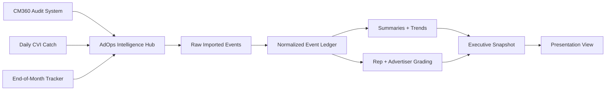

# AdOps Intelligence Hub (Project 4)

## TL;DR
AdOps Intelligence Hub is the central platform solution that joins issue and quality signals from multiple project reports into one operational and executive intelligence layer. Instead of opening separate reports by project and platform, teams can monitor account health, rep performance, and trend movement in one place with shared logic and consistent grading.

This hub currently consolidates inputs from:
- CM360 Audit System
- Daily CVI Catch
- End-of-Month Tracker

It is designed to keep expanding to additional platforms (for example DoubleVerify, Innovid, Extreme Reach) without rewriting downstream reporting each time.

## Simple Summary (Leadership First)
This project exists to replace fragmented report reading with one trusted source of truth.

Before this hub, teams had to inspect multiple exports separately and manually reconcile overlaps, ownership, and severity. With this hub, data from all participating projects is normalized, deduplicated, mapped, and summarized centrally so leadership can quickly answer:
- What percentage of trafficked placements are flagged?
- Which reps and advertisers are highest risk?
- Is performance improving or worsening over time?
- Where should the team focus first?

In short: this is a unified cross-platform intelligence layer, not just another report.

## What This Hub Does
- Ingests normalized issue exports from spoke projects.
- Preserves source context while standardizing data shape.
- Deduplicates exact full-row duplicates.
- Enriches with mapping data (network, advertiser, rep).
- Produces summary, trend, and grading outputs.
- Supports executive snapshot and presentation views.
- Supports resumable historical backfill.

## What This Hub Does Not Do
- It does not parse raw vendor attachments directly.
- It does not replace source-system issue detection logic.
- It does not own source project operational workflows.

## Table of Contents
- [Audience](#audience)
- [Business Value](#business-value)
- [Platform Model](#platform-model)
- [Visual Overview](#visual-overview)
- [Data Products](#data-products)
- [Grading Model](#grading-model)
- [Repository Layout](#repository-layout)
- [Quick Start](#quick-start)
- [Daily Operating Flow](#daily-operating-flow)
- [Timeout-Safe Run Order](#timeout-safe-run-order)
- [Troubleshooting](#troubleshooting)
- [Documentation Map](#documentation-map)

## Audience
Primary audience:
- Leadership and non-technical stakeholders who need clear account and team health visibility.

Secondary audience:
- Operators and analysts who run refreshes, validate data quality, and troubleshoot ingestion/mapping issues.

## Business Value
- Replaces multi-report manual review with one consolidated intelligence layer.
- Standardizes KPI logic so stakeholders see one consistent answer.
- Improves speed-to-decision for rep/client risk and prioritization.
- Enables scalable onboarding of new platforms with minimal downstream disruption.

## Platform Model
Hub-and-spoke pattern:
- Spokes detect and export source-specific findings.
- Hub ingests those findings and turns them into shared, cross-platform intelligence.

Current spoke sources:
- Project 1: CM360 Audit System
- Project 2: Daily CVI Catch
- Project 3: End-of-Month Tracker

Planned expansion:
- Project 5: DoubleVerify
- Project 6: Innovid
- Project 7: Extreme Reach

## Visual Overview

### Mermaid Flow


### ASCII Flow
```text
Project Reports (P1/P2/P3)
          |
          v
 AdOps Intelligence Hub
          |
          v
 Raw_Imported_Events
          |
          v
 Normalized_Event_Ledger
      /           \
     v             v
 Summaries/Trends  Grading
      \           /
       v         v
     Executive Snapshot
             |
             v
      Presentation View
```

## Data Products
Leadership-facing outputs:
- Executive_Snapshot
- Presentation_View

Operational outputs:
- Summary_By_System
- Summary_By_Network
- Summary_By_Issue_Type
- Trend_Weekly
- Trend_Monthly
- Rep_Grading
- Advertiser_Grading
- Rep_Grading_Diagnostic
- Network_Grading (diagnostic)

Core data layers:
- Raw_Imported_Events
- Normalized_Event_Ledger
- CVI_Daily_Baseline
- Network_Mapping
- Unmapped_Networks

## Grading Model
Primary performance grading uses:
- One placement counted once (multiple flags do not multiply penalty)
- Flagged placements versus total live placements

Primary grade thresholds:
- A: <= 2%
- B: >2% to 4%
- C: >4% to 7%
- D: >7% to 10%
- F: >10%

Diagnostic views remain available for issue-density context.

## Repository Layout
- src/: Apps Script source code
- docs/: detailed architecture, flow, and operations references
- temp_export5/: local workbook audit scripts and outputs

## Quick Start
Local development:
1. npm install
2. Update .clasp.json scriptId
3. npm run clasp:login
4. npm run clasp:push
5. npm run clasp:open

First-time in-sheet setup:
1. Run setupProjectSheets
2. Fill Config values
3. Run refreshNetworkMapping
4. Run refreshSourceExports
5. Run refreshCviBaselineReference
6. Run runAllSummariesFast

## Daily Operating Flow
1. Refresh Source Exports
2. Refresh CVI Baseline (Data Tab)
3. Run All Summaries (Fast)
4. Review Executive Snapshot and Presentation View

## Timeout-Safe Run Order
If runtime pressure is high, use this sequence to avoid Apps Script timeout windows:
1. Run source imports first
2. Run baseline refresh separately
3. Run summaries in fast mode

## Troubleshooting
If executive metrics show N/A or 0 live placements:
- Confirm CVI_Daily_Baseline has current rows
- Confirm refreshCviBaselineReference completed successfully in Run_Log

If rep/advertiser mapping quality appears low:
- Review Unmapped_Networks
- Update Network_Mapping source
- Rerun mapping refresh and summaries

If source contribution appears missing:
- Check Summary_By_System for expected source rows
- Validate source export tabs and source config keys

## Documentation Map
Use these for deeper technical detail:
- Architecture: [docs/ARCHITECTURE.md](docs/ARCHITECTURE.md)
- Data flow: [docs/DATA_FLOW.md](docs/DATA_FLOW.md)
- Operations: [docs/OPERATIONS.md](docs/OPERATIONS.md)

Direct section links:
- Hub contract and boundaries: [docs/ARCHITECTURE.md#hub-and-spoke-contract](docs/ARCHITECTURE.md#hub-and-spoke-contract)
- Event model details: [docs/ARCHITECTURE.md#event-model](docs/ARCHITECTURE.md#event-model)
- Full refresh flow: [docs/DATA_FLOW.md#full-refresh-workflow-runfullrefresh](docs/DATA_FLOW.md#full-refresh-workflow-runfullrefresh)
- Mapping lookup behavior: [docs/DATA_FLOW.md#network-mapping-tab---critical-lookup-table](docs/DATA_FLOW.md#network-mapping-tab---critical-lookup-table)
- First-time setup runbook: [docs/OPERATIONS.md#first-time-setup](docs/OPERATIONS.md#first-time-setup)
- Backfill runbook: [docs/OPERATIONS.md#backfill-pattern-v1](docs/OPERATIONS.md#backfill-pattern-v1)
